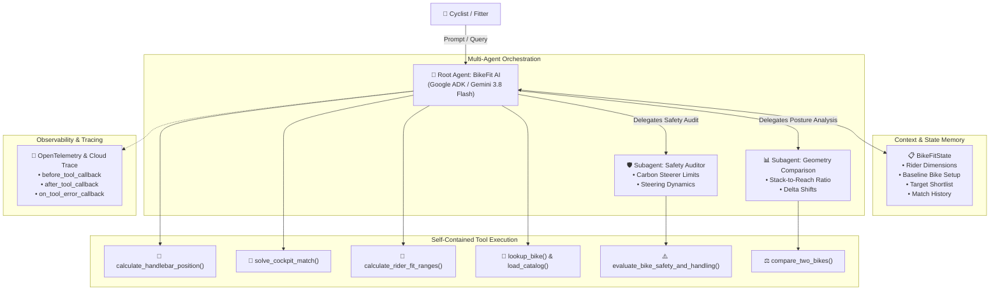

# 🚴‍♂️ BikeFit AI: Autonomous Bicycle Geometry & Cockpit Match Agent

[](https://github.com/zaratsian/bikefit-agent/actions/workflows/ci.yml)
[](https://www.python.org/)
[](https://google.github.io/adk-docs/)
[](https://docs.cloud.google.com/agent-builder/agent-engine/overview)
[](LICENSE)

An intelligent, autonomous bike fit and geometry copilot built with **Google Agent Development Kit (ADK)** and deployed on **Google Cloud Agent Platform**.

---

## 📌 Executive Summary

### The Problem
Selecting the right bicycle frame size and setup is notoriously difficult and confusing:
1. **Misleading Sizing Labels:** Frame size labels (e.g., "54cm" or "Medium") vary wildly across manufacturers. A 54cm endurance frame can fit completely differently from a 54cm aero race frame.
2. **Stack and Reach Blind Spots:** Frame Stack and Reach only measure the frame itself. The true contact points of a rider's hands—the **handlebar coordinates $(X_{\text{bar}}, Y_{\text{bar}})$** relative to the Bottom Bracket—depend on an intricate combination of headset spacer stacks, stem length, and stem angles.
3. **Expensive Fitting or Trial-and-Error Buying:** Riders often buy a new dream frame only to discover it causes neck, wrist, or lower back pain, or requires an unsafe tower of spacers exceeding manufacturer limits.

### The Solution: BikeFit AI
**BikeFit AI** is a self-contained, autonomous assistant that:
1. **Computes Exact 2D Cockpit Coordinates:** Uses deterministic trigonometry from the Bottom Bracket $(0,0)$ to compute the true position of the handlebars.
2. **Solves the "Cockpit Match" Equation:** Automatically tests real-world combinations of commercial stems ($70\text{mm} - 140\text{mm}$, angles $-17^\circ$ to $+17^\circ$) and spacers ($0\text{mm} - 40\text{mm}$) to replicate a rider's existing fit on any target frame within $\pm 1\text{mm}$.
3. **Enforces Structural Safety Standards:** Verifies compliance with CPSC/manufacturer limits (e.g., max 40mm spacers on carbon steerer tubes) and evaluates steering handling dynamics.
4. **Operates 100% Self-Contained:** Zero external paid API dependencies or rate limits.

---

## 🏗️ Architecture & Orchestration

BikeFit AI is organized using a multi-agent hierarchy orchestrated by the Google ADK:



---

## 🛠️ Tool Suite Details

1. `calculate_handlebar_position(frame_stack_mm, frame_reach_mm, head_tube_angle_deg, spacer_height_mm, stem_length_mm, stem_angle_deg) -> CockpitCoordinates`
   * Resolves the 2D vector coordinates $(X_{\text{bar}}, Y_{\text{bar}})$ from the Bottom Bracket $(0,0)$.
   * Computes the Stack-to-Reach (STR) ratio and classifies the frame (Aggressive Race, Performance, or Endurance).
2. `solve_cockpit_match(current_stack_mm, current_reach_mm, current_hta_deg, current_spacer_mm, current_stem_len_mm, current_stem_angle_deg, target_stack_mm, target_reach_mm, target_hta_deg, max_spacer_mm=40.0) -> MatchSolution`
   * Exhaustively searches the discrete commercial space of stem lengths ($70\text{mm}-140\text{mm}$), stem angles ($-17^\circ$ to $+17^\circ$), and spacers ($0\text{mm}-40\text{mm}$) to match target coordinates.
3. `calculate_rider_fit_ranges(height_cm, inseam_cm, flexibility="moderate") -> RiderFitRanges`
   * Derives anthropometric baseline starting points (LeMond saddle height, setback, and recommended STR ratio).
4. `evaluate_bike_safety_and_handling(spacer_height_mm, stem_length_mm, stem_angle_deg, is_carbon_steerer=True) -> SafetyAuditResult`
   * Enforces carbon steerer maximum spacer limits ($40\text{mm}$) and rates front-end handling responsiveness.
5. `lookup_bike(query, size=None) -> BikeLookupResult`
   * Queries local verified geometry catalog (`bikes.json`) across leading brands (Specialized, Trek, Canyon, Cervélo, Giant).
6. `compare_two_bikes(bike1_query, size1, bike2_query, size2) -> BikeComparisonResult`
   * Produces a side-by-side delta analysis and posture shift summary.
7. `search_bikes_by_category(category, size=None) -> BikeSearchResult`
   * Filters models by Race, Endurance, Aero Race, or Gravel.
8. `list_all_bikes() -> BikeListResult`
   * Returns a complete list of verified models available in the local catalog.
9. `request_human_approval(action_type, component_details, risk_level, rationale, user_confirmed=False) -> HumanApprovalResponse`
   * Human-in-the-Loop gate requiring explicit user confirmation before authorizing irreversible steerer cuts or high-risk modifications.

---

## 🚀 Quickstart Guide

### 1. Clone & Set Up Environment

```bash
git clone https://github.com/zaratsian/bikefit-agent.git
cd bikefit-agent

# Create virtual environment
python3 -m venv .venv
source .venv/bin/activate

# Install dependencies
pip install -r requirements.txt
```

### 2. Configure Environment Variables

```bash
cp .env.example .env
```

Edit `.env` with your API key:
```env
GOOGLE_GENAI_USE_VERTEXAI=0
GOOGLE_API_KEY=your_gemini_api_key_here
```

### 3. Run the Automated Test Suite

```bash
pytest
```
*All 18 unit tests execute in ~1 second with 100% determinism.*

---

## 💻 Running the Agent

### Option A: Interactive Verification Demo (Zero Configuration)
Run the built-in scenario script that walks through baseline calculation, cockpit matching, and safety audits:
```bash
python run_agent.py
```

### Option B: Google ADK Web UI
Launch the official ADK browser chat interface:
```bash
adk web .
```
Open your browser at `http://localhost:8080` to interact with BikeFit AI.

### Option C: ADK Interactive CLI
Chat directly with the agent in your terminal:
```bash
adk run bikefit_agent
```

Or execute a single-turn query:
```bash
adk run bikefit_agent "Compare a Trek Domane 56 to a Specialized Tarmac SL8 56"
```

---

## ☁️ Cloud Deployment

### 1. Deploy to Google Cloud Agent Platform

Ensure you are authenticated with Google Cloud:
```bash
gcloud auth login
gcloud auth application-default login
```

Deploy using the provided script:
```bash
export GOOGLE_CLOUD_PROJECT="your-gcp-project-id"
export GOOGLE_CLOUD_LOCATION="us-central1"

./scripts/deploy_agent_engine.sh
```

Or deploy directly with the ADK CLI:
```bash
adk deploy agent_engine \
  --project="your-gcp-project-id" \
  --region="us-central1" \
  --display_name="bikefit-agent" \
  --otel_to_cloud \
  --trace_to_cloud \
  --adk_app_object="root_agent" \
  bikefit_agent
```

### 2. Deploy to Google Cloud Run (Containerized)

Deploy via Google Cloud Build and Cloud Run:
```bash
export GOOGLE_CLOUD_PROJECT="your-gcp-project-id"
export GOOGLE_CLOUD_LOCATION="us-central1"

./scripts/deploy_cloud_run.sh
```

Or run locally with Docker:
```bash
docker compose up --build
```

---

## 📁 Repository Structure

```
bikefit-agent/
├── .github/
│   └── workflows/
│       └── ci.yml                 # GitHub Actions CI/CD pipeline
├── bikefit_agent/                 # Root ADK Agent Module
│   ├── __init__.py                # Package exports
│   ├── agent.py                   # Root Agent definition & instructions
│   ├── state.py                   # Context & Memory schema (BikeFitState)
│   ├── model_router.py            # Strategic Model Router (Gemini 3.8 Flash)
│   ├── telemetry.py               # Structured JSON logs & OpenTelemetry spans
│   ├── data/
│   │   └── bikes.json             # Verified bicycle geometry database
│   ├── memory/
│   │   ├── persistence.py         # SQLite persistent session database
│   │   ├── compaction.py          # History compaction & Gemini Context Caching
│   │   └── async_tasks.py         # Async non-blocking memory managers
│   ├── security/
│   │   ├── guardrails.py          # Input prompt injection & output safety guards
│   │   └── pii.py                 # Automated PII redaction engine
│   ├── subagents/
│   │   ├── safety_agent.py        # Structural & handling auditor subagent
│   │   └── comparison_agent.py    # Geometry comparison & ranking subagent
│   └── tools/
│       ├── geometry.py            # Coordinate trigonometry & match solver
│       ├── catalog.py             # Local catalog search & comparison tools
│       └── hitl.py                # Human-in-the-Loop approval tool
├── scripts/
│   ├── deploy_agent_engine.sh     # Google Cloud Agent Platform deployment script
│   └── deploy_cloud_run.sh        # Google Cloud Run deployment script
├── tests/
│   ├── test_agent.py              # ADK agent, subagent, and callback tests
│   ├── test_catalog.py            # Catalog search and lookup tests
│   ├── test_geometry.py           # Trigonometry & solver math tests
│   ├── test_memory.py             # Persistent DB & async compaction tests
│   └── test_security_and_hitl.py  # Security guardrails & HITL tests
├── .env.example                   # Environment configuration template
├── .gitignore                     # Git ignore rules (secrets protected)
├── Dockerfile                     # Multi-stage production container
├── docker-compose.yml             # Local container development
├── pyproject.toml                 # Package specifications & pytest config
├── requirements.txt               # Production Python dependencies
├── run_agent.py                   # Verification demonstration script
└── README.md                      # Project documentation & assessment report
```

---

## 📜 License

Distributed under the Apache 2.0 License. See `LICENSE` for details.
